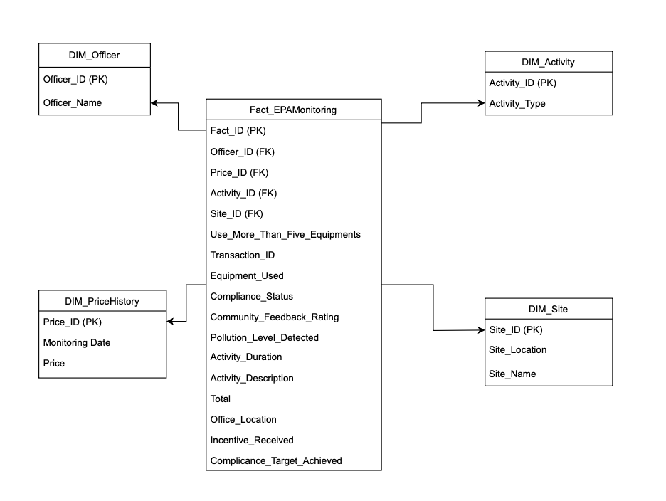

# ECA_Office_Analysis
Continuation to the [ECA_best_officer](https://github.com/shrestharohit/ECA_best_officer)

## Project Introduction
The Environmental Protection Agency (EPA) in Newcastle led by T ony Chappel, is facing quite a few challenges as budget constraints and pressure from the board to reduce operational costs. The main objective of this report is to determine the underperforming office locations based upon different categories like compliance status and total expenses incurred and provide suitable recommendations which would help the organization with organizational  restructuring or proper resource allocation.
This report emphasizes on a comprehensive analysis performed on the office locations within the Environmental Protection Agency. Our objective is to classify the different locations of offices based upon different evaluation metrics and provide insightful recommendations for the operation. Our analysis provides a stepwise breakdown on how we approached the use case to find the performance discrepancy between different office locations and subsequently provide suitable recommendations for effective operation.

## Key Analysis and Findings
Initially, the dataset we encountered was unmanaged and contained inaccuracies, hindering our ability to evaluate officer performance effectively. To address these challenges, we undertook several steps to mitigate data issues:

1. **ETL Process:** 
The provided data had a lot of discrepancies. I had to make a few assumptions for handling data.
- The uniqueness of **site**, **activity**, and **officer** was based on their names, assuming no duplicates exist for these entities.
- For calculating total expenses, a **random allocation of price** ranging from 100 to 500 was made for each monitoring date.
- Only officers **with incentives** were considered as achieving the compliance target; all others have been marked as "No."
- All **null values** based on IDs were removed to ensure data integrity.
- Each new table with newly generated IDs (e.g., `Activity_ID`, `Price_ID`) was updated in the main table.
- The final table was denormalized into a single CSV file to enable seamless use with analytical tools.

*Figure 1: Database modelling star schema.*

2. **Key Data Insights:** 
- The projected decline in compliance for Darwin and Adelaide highlights the need for immediate interventions.
- Locations with significantly better compliance are also associated with higher expenses.
- There is very little correlation between pollution levels and compliance status.

## Strategic Recommendations
1. **Operational Restructuring**:  
   Close or merge underperforming offices to reduce overhead costs and focus resources on more successful locations, starting with Adelaide and Darwin.

2. **Resource Optimization**:  
   Centralize key administrative tasks and services, allocating resources centrally, including staff. Utilize real-time data insights to allocate more resources to better-performing sites for improved outcomes.

3. **Incentive Program Revision**:  
   Revise the current incentive structure to directly tie rewards to the best-performing officers. Instead of providing incentives before tracking compliance, offer benefits only after successful project delivery.

4. **Incorporate Predictive Analysis**:  
   Leverage real-time insights to enable proactive management, prevent future compliance shortfalls, and ensure efficient resource utilization.

## Officer Performance Metrics
This report provides a comprehensive strategy to address the EPA’s performance and budget challenges through targeted office restructuring, resource optimization, and revamped incentives. By implementing predictive dashboards and evidence-based decisions, the EPA can enhance operational efficiency, ensure compliance improvements, and achieve significant cost
reductions. These recommendations will enable the EPA to meet board expectations while maintaining public trust and transparency in its operations.